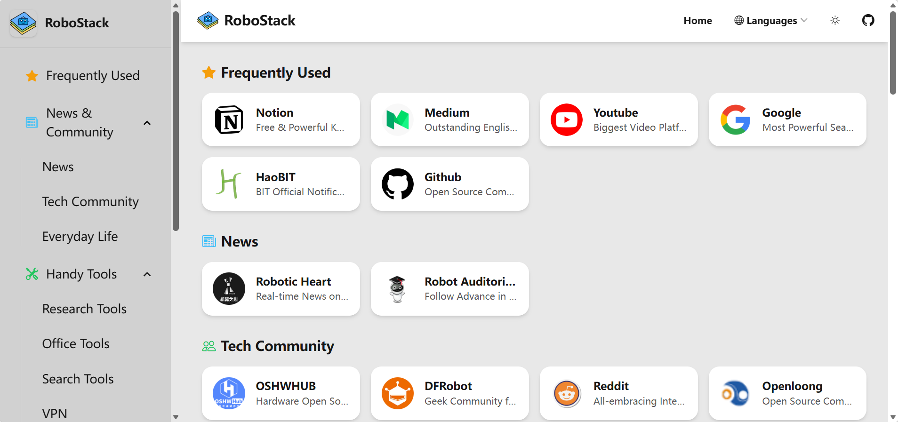

# 🤖 RoboStack



A modern site navigation page incorporating robotics-related resources and handy tools, built with **Tailwind CSS** and **DaisyUI**.

This project is inspired by the open-source site navigation page [WebStack](https://github.com/WebStackPage/WebStackPage.github.io).

## ✨ Features

- **Modern UI** - Built with Tailwind CSS and DaisyUI for a clean, responsive design
- **Dark Mode** - Toggle between light and dark themes, with preference saved locally
- **Responsive Layout** - Works seamlessly on desktop, tablet, and mobile devices
- **Smooth Animations** - Card hover effects and smooth scrolling navigation
- **Bilingual Support** - Available in English and Chinese

## 📚 Content

RoboStack focuses on **tech-related resources** for robotics:

- **News & Community** - Latest news and tech communities
- **Handy Tools** - Research tools, office tools, search tools, VPN, and dev tools
- **Tech Resources** - Simulation & robot learning, circuit, control
- **Thoughtful Blogs** - Insights from robotics experts
- **Nav Recommendation** - Other useful navigation sites

Different from [Nullno](https://nullno.com/) which includes industry resources (companies, labs, conferences), we focus on technical resources for robotics developers.

## 🚀 Getting Started

### Prerequisites

- Node.js (v16 or higher)

### Installation

```bash
# Install dependencies
npm install

# Build CSS
npm run build

# Watch for changes during development
npm run watch
```

### Usage

Simply open `index.html` (English) or `index_cn.html` (Chinese) in your browser.

## 🛠️ Tech Stack

- [Tailwind CSS](https://tailwindcss.com/) - Utility-first CSS framework
- [DaisyUI](https://daisyui.com/) - Tailwind CSS component library
- [Bootstrap Icons](https://icons.getbootstrap.com/) - Icon library

## 📝 License

This project is open source and available under the [MIT License](LICENSE).

## 🙏 Acknowledgments

- [WebStack](https://github.com/WebStackPage/WebStackPage.github.io) - Original inspiration
- [Nullno](https://nullno.com/) - Robotics resource reference
